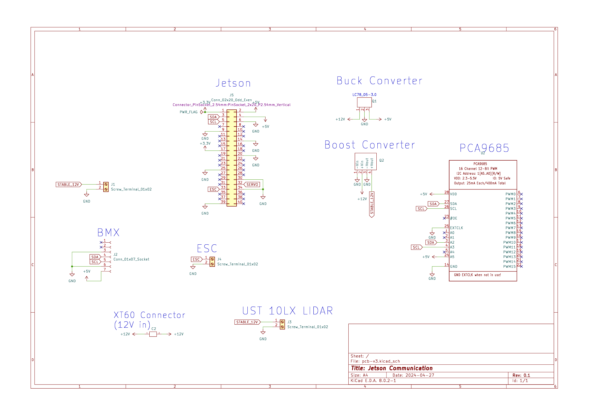

# Slug-Mobile

Slug Mobile: One Tenth Scale Autonomous Vehicle

CARLA gym environment: <https://github.com/cruz-control/carla-gym-env.git>

## Get Stated

Run the following command to install all the dependencies

```bash
pip3 install -r requirements.txt
```

Next you can import the `SlugMobile` class from slug-mobile.py into your computer/ jetson of choice to interact with the car.

## Setup Car

### Sensor Mount

Here's a link to the CAD for the sensor mount: [OnShape Link](https://cad.onshape.com/documents/b2439afa538affcdb2ce625c/w/6e13cd6ddc2a3739fa3b2738/e/3fdea52f99cf651c55640d90?renderMode=0&uiState=669d97643e0ca32c1d4d6b9b)

### Electrical System

We have included the custom power distribution board we created to the `power_dist_board` folder, the schematics show how to connect the different components.


